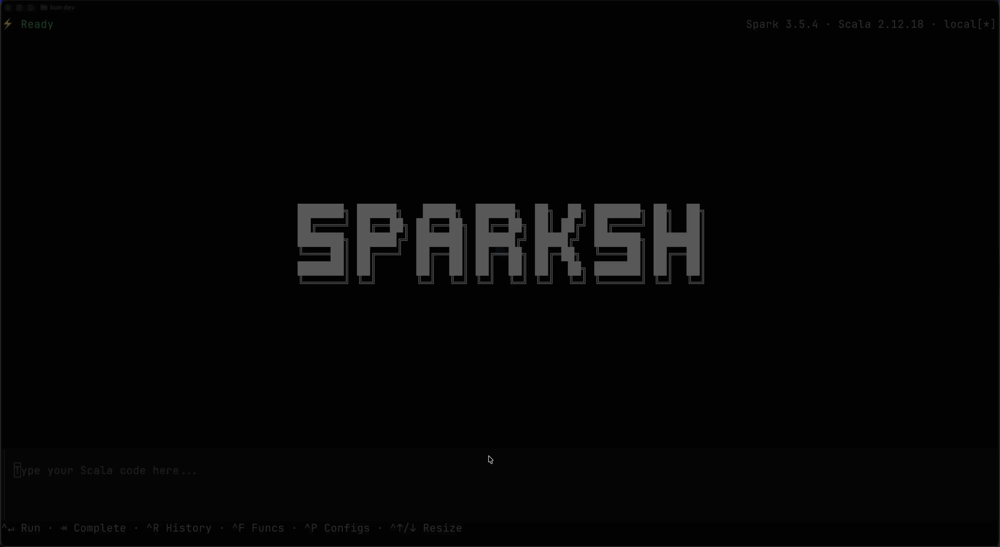

# SparkSH

A modern terminal UI for Apache Spark with syntax highlighting, auto-completion, and a better interactive experience.



## Prerequisites

- **Java 11+** - Required to run Spark
- **Apache Spark** - Set `SPARK_HOME` environment variable

## Installation

### One-liner install (macOS/Linux)

```bash
curl -fsSL https://raw.githubusercontent.com/SultanRazin/sparksh/master/install.sh | bash
```

This automatically detects your OS and architecture, then downloads the correct binary.

## Usage

```bash
# Start SparkSH with default settings
sparksh

# Specify master
sparksh --master local[4]
sparksh --master spark://host:7077

# Pass Spark configuration
sparksh --conf spark.sql.shuffle.partitions=10

# Show help
sparksh --help
```

## Supported Spark Versions

SparkSH automatically detects your Spark version and uses the appropriate backend:

- Spark 3.4.x
- Spark 3.5.x
- Spark 4.0.x

## Built With

- [Bun](https://bun.sh/) - JavaScript runtime and bundler
- [OpenTUI](https://github.com/anomalyco/opentui/) - Terminal UI framework
- [Shiki](https://shiki.style/) - Syntax highlighting
- [Scala](https://www.scala-lang.org/) - Backend language